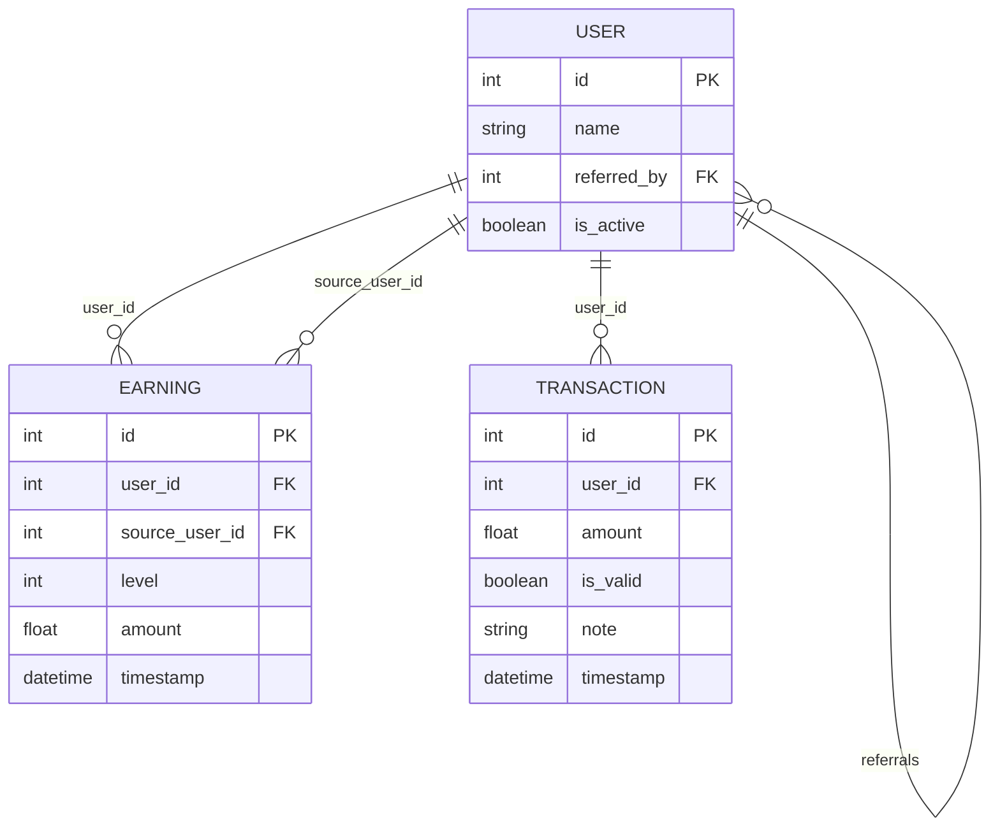

Multi-Level Referral System with Real-Time Earnings

A FastAPI backend system for managing a multi-level referral program with real-time earning notifications, built on SQLModel and SQLite, featuring live updates via Server-Sent Events (SSE).

Features:-
Referral System:
Users can refer up to 8 direct referrals.
Referral hierarchy supports direct (level 1) and indirect (level 2) earnings.
Users status can be set active/inactive to control commission eligibility.
Earnings & Commissions
Earnings calculated on purchases ≥ ₹1000 only.

Commission split:
5% to direct referrer (Level 1).
1% to grand referrer (Level 2).
Each user can earn a maximum of ₹1000 commission per level.
Earnings and transactions are logged with timestamps.

Real-Time Updates:
Users receive live commission updates via Server-Sent Events (SSE).
Frontend dashboard listens for updates without page refresh.

API Endpoints:-
Create users, refer users, record purchases.
Get referral lists (direct & indirect).
Get earnings summaries and breakdowns.
Deactivate/reactivate users to control commission eligibility.
Real-time event stream for earnings updates.

Data Model:
User table stores user info, referral relationships, active status. Fields: id, name, referred_by, is_active
Earning	table logs earnings by user, referral level, and source user. Fields: user_id, source_user_id, level, amount, timestamp
Transaction	table logs purchase transactions with validity and notes. Fields: user_id, amount, is_valid, note, timestamp


Installation & Setup
```bash
git clone https://github.com/vineetkumardeva/bkedssda.git
cd bkedssda
pip install -r requirements.txt
uvicorn main:app --host 0.0.0.0 --port 8000 --reload
```
API Reference
1. Create User
```http
POST /user?name=<username>
```
Response:
```json
{ "user_id": 1 }
```
2. Refer a User
Assign an existing user as the referrer of another user, with a max of 8 direct referrals.
```http
POST /refer?referrer_id=<referrer_id>&user_id=<user_id>
```
Responses:

200 OK: User successfully referred.
400 Bad Request: Referral limit reached or user already referred.
404 Not Found: Referrer or user not found.

3. Record a Purchase
Register a purchase and distribute referral commissions.
Only applies commissions if amount ≥ ₹1000.

```http
POST /purchase?buyer_id=<buyer_id>&amount=<amount>
```
Returns details of distributed commissions.

4. Get Referrals
Get direct and indirect referrals for a user.
```http
GET /referrals/{user_id}
```
5. Get Earnings Summary
Retrieve total and level-wise earnings for a user.
```http
GET /earnings/{user_id}
```
Response:
```json

{
  "user_id": 2,
  "total_earnings": 430.0,
  "earnings_by_level": {
    "1": 350.0,
    "2": 80.0
  },
  "details": [
    {
      "source_user_id": 5,
      "level": 1,
      "amount": 100.0,
      "timestamp": "2025-06-23T10:00:12.345Z"
    },
  ]
}
```

6. Real-Time Earnings Updates (SSE)
Subscribe to live earnings events for a user.
Stream updates whenever new commissions are credited.

```http
GET /events/{user_id}
```

7. User Status Management
Deactivate or reactivate users to control commission eligibility.
```http
PATCH /user/{user_id}/deactivate
PATCH /user/{user_id}/reactivate
```
8. Leaderboard (Top Earners)
Returns the top 10 users with the highest total earnings.

```http
GET /leaderboard
```

Example Response:
```json
[
  { "user_id": 1, "name": "Alice", "total_earnings": 765.5 },
  { "user_id": 2, "name": "Bob", "total_earnings": 645.0 },
 
]
```
Frontend:-

Dashboard (static/index.html): Shows live total earnings and level-wise breakdown, allows simulating purchases.Visualizations include a Bar Chart showing earnings by referral level to give a quick comparative view and a Live-updating counters for total earnings and each referral level’s earnings.

Referrals Viewer (static/referrals.html): Displays direct and indirect referrals for a user in a nested-bullet format. Active users are green while inactive users are red.


Architecture & Design Notes:-

Referral Limit: Each user can have up to 8 direct referrals.
Earnings Cap: Users can earn up to ₹1000 per level.
Inactive Users: Do not receive commissions.
Real-Time Updates: Implemented using SSE and asyncio queues.
Database: SQLite via SQLModel with relationships and foreign keys.
Security & Validation: Basic validation on inputs and purchase thresholds.

Development Notes :-

Uses FastAPI lifespan event to create DB tables on startup.
Implements self-referential relationship on User for referrals.
SQLAlchemy core functions used for aggregation (sum of earnings).
SSE queue dictionary indexed by user_id for notifications.

SSE Engine Details:-

The system uses asyncio queues and SSE (Server-Sent Events) to provide live earnings updates:
Each user has a queue (in-memory) identified by their user_id.
When a qualifying purchase happens:
Referrers (level 1 and level 2) receive data like:

```json
{
  "amount": 75.00,
  "level": 1
}
```
Frontend JavaScript (EventSource) listens to /events/{user_id} and updates the dashboard in real time.



