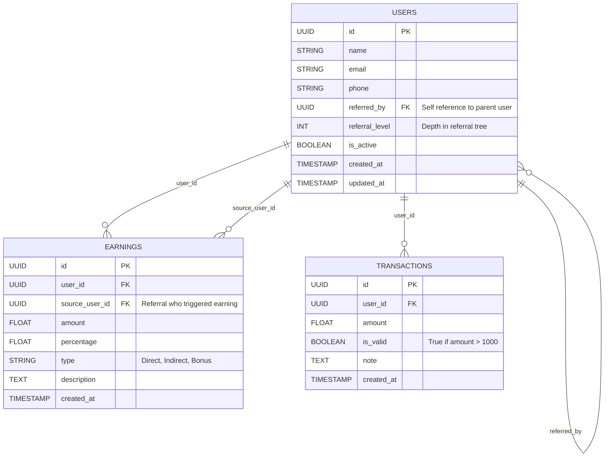

# Multi-Level Referral System
A backend system for tracking multi-level referral earnings, built with **FastAPI**, **SQLModel**, **SQLite**, and hosted on **Replit**.

```bash
git clone https://github.com/vineetkumardeva/bkedssda.git

cd bkedssda

pip install -r requirements.txt

# Run the server
uvicorn main:app --host 0.0.0.0 --port 8000 --reload
```

---

## Project Structure

* **models.py**
  Defines database tables:

  * `User` table supports referral hierarchy.
  * `Earning` table tracks earning events.

* **main.py**
  Sets up the FastAPI app with lifespan-based DB table creation and includes a Root `GET /` endpoint to verify the app is running.

* **requirements.txt**
  Lists dependencies (FastAPI, Uvicorn, SQLModel).

* **static/**
* Contains index.HTML 
Frontend Dashboard-This is a simple interactive HTML dashboard for testing and monitoring referral earnings in real-time.

Features:
Displays Total Earnings
Shows cumulative earnings across Level 1 and Level 2 referrals.

Breakdown by Referral Level
Separate tracking of Level 1 (direct) and Level 2 (indirect) commissions.

Test Purchase Button
Simulates a purchase by user_id=1 for ₹1500. Triggers backend /purchase API and updates the UI with any distributed earnings.

Real-Time Updates via SSE
Connects to the /events/1 endpoint using Server-Sent Events (SSE). Updates the earnings display whenever new commission is credited live.

Referrals Viewer (static/referrals.html)
This HTML page displays a user's referral network, separating direct and indirect referrals in a simple UI.

Features:
Direct Referrals List
Shows all users directly referred by the specified user (hardcoded as user_id=1).

Indirect Referrals List
Displays users indirectly referred (i.e., referred by the direct referrals), including the intermediate referrer (via field).

---

## Referral Logic (`/refer` Endpoint)

Allows users to refer up to **8 direct referrals**.

---

## API Reference

### 1. Create User

Creates a new user.

**POST** `/user`

**Query Parameter:**
`name` (string) — name of the user

**Response:**

```json
{ "user_id": 1 }
```

---

### 2. Refer a User

Allows an existing user to refer a new one, with a max of 8 direct referrals.

**POST** `/refer`

**Query Parameters:**

* `referrer_id` (int) — ID of the existing user (referrer)
* `new_user_name` (string) — name of the new user being referred

**Responses:**

* **200 OK**

  ```json
  { "message": "User referred", "new_user_id": 2 }
  ```

* **404 Not Found**

  ```json
  { "detail": "Referrer not found" }
  ```

* **400 Bad Request**

  ```json
  { "detail": "Referral limit reached" }
  ```

---

### 3. Record a Purchase

Processes a user’s purchase and distributes earnings as commissions:

* 5% to direct referrer (level 1)
* 1% to grand-referrer (level 2), only if purchase amount ≥ ₹1000

**POST** `/purchase`

**Query Parameters:**

* `buyer_id` (int) — ID of the purchasing user
* `amount` (float) — purchase total in ₹

**Responses:**

* **200 OK** (commissions applied)

  ```json
  {
    "message": "Purchase processed",
    "distributed": [
      [1, 75.0, 1],
      [3, 15.0, 2]
    ]
  }
  ```

* **200 OK** (no commission, amount < ₹1000)

  ```json
  { "message": "No commissions for purchases below ₹1000." }
  ```

* **404 Not Found**

  ```json
  { "detail": "Buyer not found" }
  ```

---

### 4. Get Earnings Summary

Retrieves a user’s total earnings, broken down by level and source.

**GET** `/earnings/{user_id}`

**Path Parameter:**
`user_id` (int) — ID of the user

**Sample Response:**

```json
{
  "user_id": 1,
  "total_earnings": 90.0,
  "earnings_by_level": { "1": 75.0, "2": 15.0 },
  "details": [
    { "source_user_id": 2, "level": 1, "amount": 75.0, "timestamp": "..." },
    { "source_user_id": 2, "level": 2, "amount": 15.0, "timestamp": "..." }
  ]
}
```

---

### 5. Real-Time Earnings (SSE)

Creates a **Server-Sent Events (SSE)** stream delivering live updates whenever commissions are credited to the user.

**GET** `/events/{user_id}`

**Path Parameter:**
`user_id` (int) — ID of the user subscribing to updates

**Browser Example (JavaScript):**

```js
const evt = new EventSource("/events/1");
evt.onmessage = e => console.log("Earning received:", JSON.parse(e.data));
```

**Sample Event Message:**

```json
{ "amount": 75.0, "level": 1 }
```

---

### 6. Referrals

Fetches both direct and indirect referrals for a user.

**GET** `/referrals/{user_id}`

**Path Parameter:**
`user_id` (int) — ID of the user to query

**Sample Response:**

```json
{
  "user_id": 1,
  "direct_referrals": [
    { "id": 2, "name": "Bob" },
    { "id": 3, "name": "Charlie" }
  ],
  "indirect_referrals": [
    { "id": 4, "name": "Dave", "via": 2 }
  ]
}
```

---

## Database Schema



