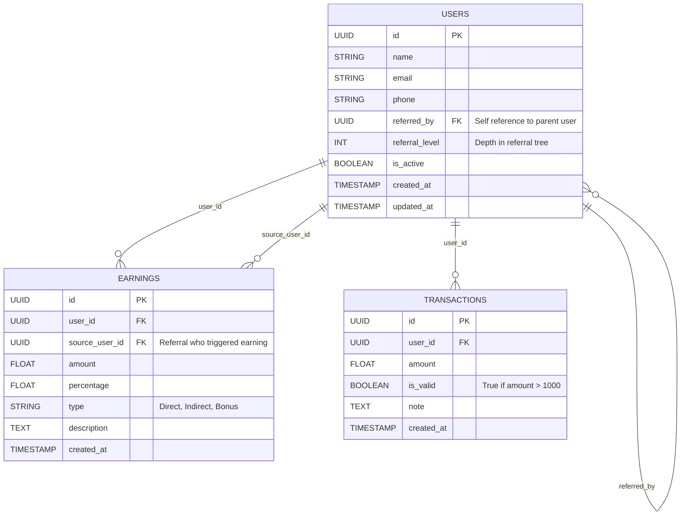

Multi-Level Referral System 
A backend system for tracking multi-level referral earnings, built with FastAPI,SQLModel,SQLite and hosted on Replit.

git clone https://github.com/vineetkumardeva/bkedssda.git
cd bkedssda
python3 -m venv venv
source venv/bin/activate 
pip install -r requirements.txt

#run 
uvicorn main:app --host 0.0.0.0 --port 8000 --reload

Files
models.py:
Defines database tables:
User table supports referral hierarchy
Earning table tracks earning events

main.py:
Sets up FastAPI app with lifespan-based DB table creation and Root GET / endpoint to verify app is running

requirements.txt – Lists dependencies (fastapi, uvicorn, sqlmodel)

Referral Logic (/refer Endpoint) Allows users to refer up to 8 direct referrals.


API Reference
1. Create User
 Creates a new user.
**POST** `/user` 

Query Parameter- name of type string ie name of user

**Response**

```json
{ "user_id": 1 }
```
2. Refer a User
Allows an existing user to refer a new one, with a max of 8 direct referrals.

**POST** `/refer`

Query Parameters- referrer\_id of type int which is ID of the existing (referrer) user and new\_user\_name is of string type which is name of the new user being referred 

**Responses**
* **200 OK**
  ```json
  { "message": "User referred", "new_user_id": 2 }
  ```
* **404 Not Found**
  ```json
  { "detail": "Referrer not found" }
  ```
* **400 Bad Request**
  ```json
  { "detail": "Referral limit reached" }
  ```

3. Record a Purchase
Processes a user’s purchase → distributes earnings:
* 5% to direct referrer (level 1)
* 1% to grand‑referrer (level 2)
  only if `amount ≥ ₹1000`.

**POST** `/purchase`
Query Parameters-buyer\_id which is of int type ie ID of the purchasing user and amount of float type Purchase total in ₹ 
**Responses**

* **200 OK** (commissions applied)

  ```json
  {
    "message":"Purchase processed",
    "distributed":[
      [1, 75.0, 1],
      [3, 15.0, 2]
    ]
  }
  ```
* **200 OK** (no commission, amount < 1000)

  ```json
  { "message": "No commissions for purchases below ₹1000." }
  ```
* **404 Not Found**

  ```json
  { "detail": "Buyer not found" }
  ```

 4. Get Earnings Summary
Retrieves user’s total earnings, broken down by level and source.

**GET** `/earnings/{user_id}`


**Path Parameter**
| user\_id which is of int type it is ID of the user
**Sample Response**

```json
{
  "user_id":1,
  "total_earnings":90.0,
  "earnings_by_level":{"1":75.0,"2":15.0},
  "details":[
    {"source_user_id":2, "level":1, "amount":75.0, "timestamp":"..."},
    {"source_user_id":2, "level":2, "amount":15.0, "timestamp":"..."}
  ]
}
```

5. Real-Time Earnings (SSE)
Creates a **Server-Sent Events (SSE)** stream delivering live updates whenever commissions are credited to the user.


**GET** `/events/{user_id}`

**Path Parameter**
user\_id datatype int it is the ID of the user subscribing to updates 

**Browser Example (JS):**

```js
const evt = new EventSource("/events/1");
evt.onmessage = e => console.log("Earning received:", JSON.parse(e.data));
```

Each message looks like:

```json
{ "amount": 75.0, "level": 1 }
```


6.Referals
Fetches both direct and indirect referrals for a user.

GET /referrals/{user_id}

**Path Parameter:** 
user_id of  int type which is ID of the user to query      

Sample Response:
json{
  "user_id": 1,
  "direct_referrals": [
    {"id":2,"name":"Bob"},
    {"id":3,"name":"Charlie"}
  "indirect_referrals": [
    {"id":4,"name":"Dave","via":2}
  
}

 Database Schema

